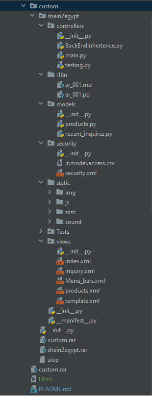

# Gebly4in Website
Web scrapper module

## Introduction
 Here is an overview about the website folders and the purpose of each one;
 -  **Custom** {Adding your custom Add-ons(modules)}
      - `shein2egypt`  First moudle made to integrate with the framework

  -  **shein2egypt** {module Folder}
      - `__init__.py`  contains import instructions for various Python files in the module.
      - `__manifest__.py`  -	Serves to declare a python package as an Odoo module and to specify module metadata , contains a single Python dictionary, where each key specifies module meta data.

  - **controllers** {Handle requests from web browsers}
      - `__init__.py`  contains import instructions for various Python files in the module.
      - `BackEndInhertence.py`  -	inherting and existing module and overriding its functions and componenets (adding filters)
      - `main.py`  - handels requests from the web scrapper page

 - **i18n** {generate localized UTF-8 reports (Translations)}
      - `ar_001.po` - translations of the page module componenets 
 
 - **models** {Business objects are declared as Python classes extending Model which integrates them into the automated persistence system}
      - `products.py` - integrating new attributes and functions to the existing fields and model
      - 
 - **security** {To manage users and configure  security access rights}
      - `__init__.py`  contains import instructions for various Python files in the module.
      - `ir.model.access.csv`  -	declaring the rights to groups

 - **Static** {Images, CSS or JavaScript files used by the web interface or website}

 - **Tests** {Dump Folder for storing testing data}
 
 - **Views** {Definition of business objects UI display}
      - `__init__.py`  contains import instructions for various Python files in the module.
      - `Menu_bars.xml`  -	Adding menus to header of page template
      - `products.xml`  -	Addings UI to the product views
      - `template.xml`  -	Web Scrapper page
 

  

## technical requirments
   ### 2.1. `index.html`
